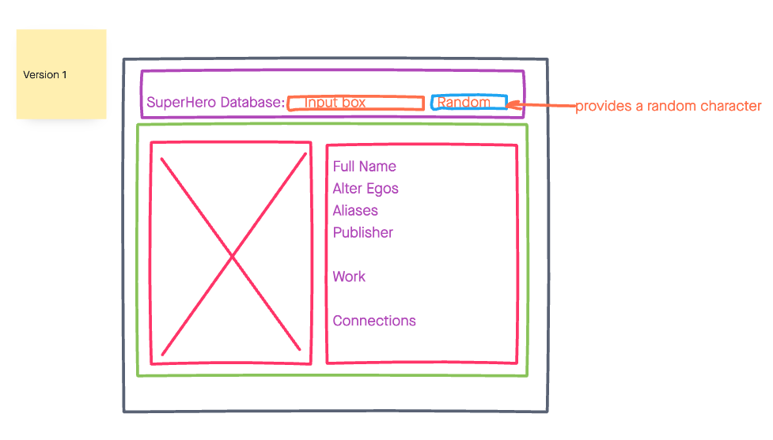

# SuperHero Database

A simple web app for visualizing basic information about comicbook characters.

## Technologies

- HTML5
- CSS
- JavaScript/JQuery
- [SuperHero](https://www.superheroapi.com)

## Screenshots

### WireFrames
 

 

### Image of the API

### Image of mobile view

## Getting Started

[click here](https://superdata.netlify.app/) to see working app

## Future Enhancements

- Offer comicbook suggestions
- Auto fill search 
- Allow a users to save their favorite heroes
- Villains only page
- Compare powerstats and see who would win 
